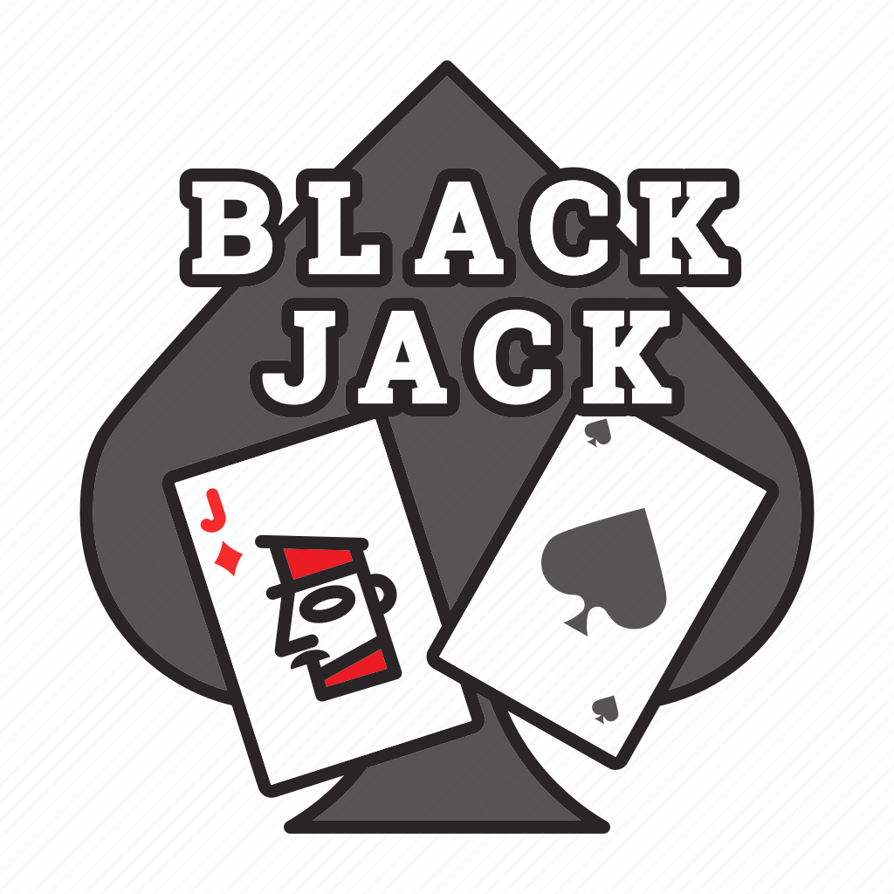

# Blackjack Game Demo
### Revision 1.0

---

### Game rules
Blackjack is one of the easiest card games to play:
+ Cards 2 through 10 have a value written on them, while figures **(J, Q, K)** have a value of 10, the ace **(A)** can have a value of 1 or 11.
+ Players play against a person called **the Dealer** and in order to win they must have a higher number of cards than the dealer. If the sum of the cards exceeds the value **21** the player loses. If the dealer exceeds the value **21**, then everyone present at the table wins, except those who have exceeded **21** before the dealer.
+ Each player receives 2 cards at the beginning, and the dealer also receives 2 cards, but one is reversed (**ATTENTION!** In the real game of Blackjack each player receives one card at a time, to **simplify** the problem, we will consider that the players receive the 2 cards from the get go, and the dealer is the last person to receive the 2 cards).
+ After the cards have been dealt, each player has the right to draw a card **(HIT)** or to stop at the amount he already has **(STAND)**. Players can draw as many cards as they want, but if they exceed 21 they lose (**ATTENTION!** For simplicity we will consider the following scenario: If the sum of the dealer's or player's cards is less than 16, they are required to draw a card. If the sum of the cards is between 17 and 21, they must stop drawing cards. If the amount is more than 21 they lost).

### Requirements
1) If the **command** is *check_cards*, check if the deck of cards is rigged, if it is a normal deck, or if it is a blackjack-ready deck. A deck of cards is considered rigged if there are cards whose numbers or coats of arms do not actually exist (the allowed numbers are 2 to 14, where 11 is the ace and the allowed coats of arms are **spade**, **heart**, **clover** or **diamond**) and *Rigged package* will be displayed. A deck of cards is considered OK if it is not rigged, if all the cards in it are different, and if there are a total of 52 cards, in which case *Deck of cards OK* will be displayed. A deck of cards is considered good for Blackjack if it is not rigged, in which case *Ready for Blackjack* will be displayed.
2) If the command is *shuffle_cards*, shuffle the cards using the **Linear Congruential Generator (LCG)** algorithm. The generator is defined by the recurrence relation **Xn + 1 = (a * Xn + c) modulo m**. If 2 pairs of numbers a, c and X0 are given from the keyboard, then a pair of indexes will be generated and the cards in those positions will be exchanged, and the current index will become the previous index for the generator.
